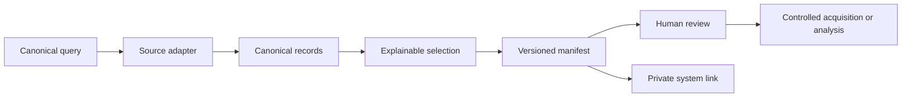

<p align="center">
  
</p>

<h1 align="center">TraceFoundry</h1>

<p align="center"><strong>Evidence infrastructure for high-stakes discovery.</strong><br />Find what matters. Prove why it matters. Know what is still missing.</p>

TraceFoundry is a metadata-first discovery engine for teams that need to move from fragmented public information to a **defensible next decision**. It connects scientific datasets, papers, patents and research assets across sources, normalizes their metadata, applies explicit eligibility rules, records why candidates were selected or rejected, and produces a versioned manifest that can be reviewed before anyone spends time or money on acquisition, analysis or partnership.

The project was formerly named **OI Discovery**. The technical namespace remains `oi_discovery` for compatibility; the public product identity is now TraceFoundry.

[](https://github.com/viniburilux/TraceFoundry)
[](docs/TEST_MATRIX.md)
[](LICENSE)
[](pyproject.toml)

## The problem

Discovery work is rarely blocked by a lack of information. It is blocked by **fragmentation, ambiguous identifiers, incompatible source models, undocumented rejection decisions and evidence that cannot be revisited**.

A search result is not yet a candidate. A candidate is not yet a validated asset. A paper is not proof that a dataset exists. A dataset title is not proof of biological or technical suitability. TraceFoundry keeps these distinctions visible instead of hiding them behind a ranking score or a generated summary.

> **TraceFoundry does not replace expert judgment. It makes expert judgment faster to start, easier to audit and harder to accidentally overstate.**

## What TraceFoundry delivers

| Capability | Practical outcome |
|---|---|
| Cross-source discovery | One canonical query can be adapted to DANDI, Zenodo, OpenAlex and PatentsView. |
| Canonical metadata | Source-specific responses become stable dataset and asset records with identifiers, URLs, versions and warnings. |
| Explainable selection | Every candidate carries eligibility, rejection reasons and provenance rather than an opaque rank. |
| Negative evidence | “No eligible result” is represented separately from a source failure, rate limit or missing credential. |
| Reproducible manifests | A query, timestamp, source observations and selection decisions can be versioned and reviewed later. |
| Safe handoff | A manifest can become a reviewable link to a private memory or research system without writing to a database automatically. |
| Metadata-only boundary | The public core does not download scientific datasets or deserialize pickle, NWB or HDF5 files. |

## Where it fits

TraceFoundry is designed for **technology intelligence, R&D scouting, scientific due diligence, partner discovery, research operations, patent landscape work and evidence-led product exploration**.

The same architecture can support organoid research, clean technology, energy transition, food security, environmental monitoring, industrial efficiency and infrastructure for sustainable production. The domain changes; the discipline of provenance, explicit constraints and reviewable absence remains the same.

## A five-minute first run

```bash
python3 -m venv .venv
. .venv/bin/activate
python -m pip install -e .

PYTHONPATH=src python scripts/oi_discover.py \
  --source dandi \
  --dataset-id 001603 \
  --version draft \
  --format nwb \
  --max-assets 1 \
  --output discovery_result.json
```

The output is a metadata manifest. It records `download_performed: false` and can be inspected before any controlled acquisition.

To search patent metadata, provide the PatentsView credential explicitly:

```bash
export PATENTSVIEW_API_KEY="..."
PYTHONPATH=src python scripts/oi_discover.py \
  --source patentsview \
  --dataset-id "methanol detection" \
  --max-assets 5 \
  --output patents_result.json
```

To hand a manifest to a private memory system without changing its database:

```bash
PYTHONPATH=src python scripts/link_manifest_to_luxmemory.py \
  --manifest discovery_result.json \
  --output discovery_memory_link.json \
  --memory-type result \
  --capability-id CAP-OBS-EVIDENCE_MEMORY_DECISION
```

## How it works



The public core intentionally stops before scientific interpretation. It can establish what a source reported at a given time and why a deterministic policy selected or rejected an item. It cannot prove data quality, biological relevance, statistical validity, license compatibility for every derivative or suitability for a particular hypothesis.

## Current source coverage

| Adapter | Mode | Credential | Typical use |
|---|---|---|---|
| DANDI | Metadata-only live queries | No | Neurophysiology and organoid dataset discovery. |
| Zenodo | Metadata-only live queries | No | Research records, datasets and artifacts. |
| OpenAlex | Metadata-only live queries | No | Papers, authors, institutions and citation context. |
| PatentsView | Offline normalization and conditional live queries | `PATENTSVIEW_API_KEY` | Patent metadata, classifications, inventors, assignees and family fields. |

The cross-domain smoke tests exercise organoid, environmental and technology-oriented queries. The public benchmark records source limitations rather than presenting a blocked source as a scientific negative.

## Validation and evidence

Run the offline suite without credentials or network access:

```bash
PYTHONPATH=src python tests/run_offline_tests.py
PYTHONPATH=src python tests/run_dsl_registry_tests.py
```

Run metadata-only live checks when network access is available:

```bash
PYTHONPATH=src python tests/run_live_metadata_tests.py
PYTHONPATH=src python tests/run_cross_domain_live_tests.py
```

The repository includes a reproducible [test matrix](docs/TEST_MATRIX.md), [cross-domain results](docs/CROSS_DOMAIN_TESTS.md), [Benchmark v0 report](docs/BENCHMARK_V0_RESULTS.md), [architecture notes](docs/ARCHITECTURE.md) and [commercial positioning](docs/POSITIONING.md). The benchmark is a proof of infrastructure, not a claim that TraceFoundry has already demonstrated productivity gains against manual search or conventional RAG.

## The core contract

New sources implement the adapter contract and map native responses into `DatasetRecord` and `AssetRecord`. The source adapter preserves raw metadata, official URLs, source identifiers, version information and explicit warnings. Common selection policy stays in the shared layer so that datasets, papers, patents and future sources can be compared without duplicating decision logic.

```text
source API → adapter → canonical records → explainable selection
           → manifest → review link → controlled acquisition or analysis
```

The Python package and CLI retain the stable `oi_discovery` namespace so existing integrations do not break during the public rebrand.

## Public core, private laboratory

TraceFoundry is the reusable public infrastructure layer. Domain-specific research scripts, derived scientific data, investigation state, private decisions and memory remain outside this repository. That boundary is deliberate: the public product demonstrates reproducibility and provenance without exposing a private research laboratory or pretending that metadata is scientific validation.

## Roadmap

The next product gate is not “add more adapters.” It is to test whether a manifest can reduce the time and ambiguity required to reach a defensible next action. Planned extensions include stronger entity resolution, cross-source deduplication, claims and evidence links, readiness gates, paper-to-code relationships and a private research-state layer built on top of the public manifest contract.

## Contributing

Contributions are welcome when they preserve the core principles: metadata-only by default, explicit provenance, deterministic selection, negative evidence as a valid result and no scientific conclusion without supporting evidence. Start with [CONTRIBUTING.md](CONTRIBUTING.md) and read the [architecture guide](docs/ARCHITECTURE.md) before adding a source adapter.

## License

The public core is released under the [MIT License](LICENSE). Datasets, papers, external APIs and private research artifacts remain subject to their own terms.

## References

[1]: docs/BENCHMARK_V0_RESULTS.md "Benchmark v0"
[2]: docs/TEST_MATRIX.md "Test matrix"
[3]: docs/CROSS_DOMAIN_TESTS.md "Cross-domain tests"
[4]: docs/ARCHITECTURE.md "TraceFoundry architecture"
[5]: docs/POSITIONING.md "TraceFoundry positioning"
