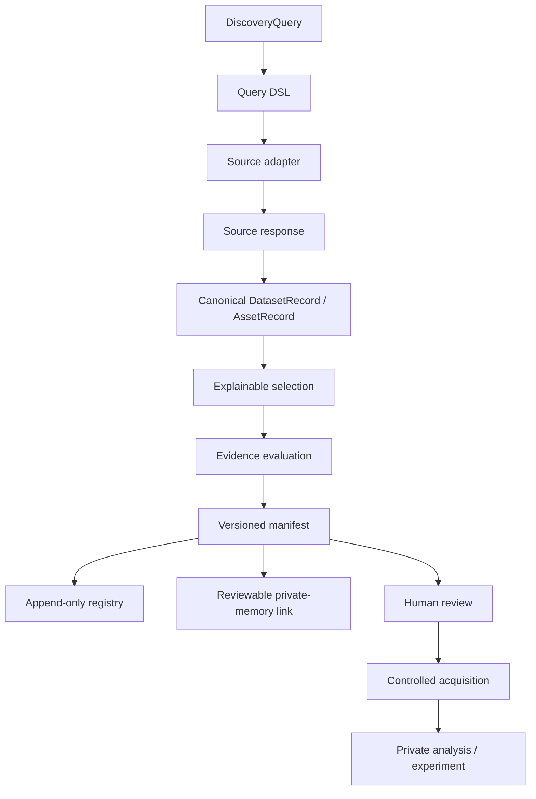
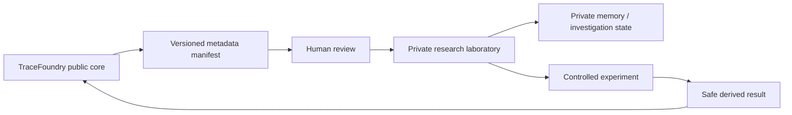

# TraceFoundry — arquitetura

## Visão geral

TraceFoundry é organizado como um pipeline de descoberta e decisão, não como um chatbot. Cada camada possui uma responsabilidade pequena e uma saída verificável.

## Contratos

### Query

`DiscoveryQuery` representa a intenção operacional sem acoplar a aplicação a uma API específica. Campos como `source`, `dataset_id`, `version`, `formats`, `max_size_bytes`, `access`, `limit` e `provenance_required` são interpretados pelo adapter e validados pelo contrato comum.

### Records

`DatasetRecord` descreve o contêiner publicado pela fonte. `AssetRecord` descreve um item ou arquivo observável dentro desse contêiner. Os records preservam `source`, `source_id`, `title`, `url`, `version`, `license`, `size_bytes`, `format`, `access`, `metadata` e warnings quando disponíveis.

### Selection

A seleção é determinística e explicável. Um resultado elegível é um **candidato operacional**, nunca uma conclusão científica. Rejeições são armazenadas com o motivo; uma lista vazia pode significar que as restrições foram realmente satisfeitas por zero registros, mas também pode exigir interpretação contextual da ontologia da fonte.

### Manifest

O manifest é a unidade de reprodução. Ele registra a query normalizada, seu hash, fonte, timestamp, observações, candidatos, decisões, limitações e a política de download. O core público exige que a execução de discovery permaneça metadata-only.

## Fontes e adapters

Cada adapter traduz uma API nativa para o contrato canônico. Essa decisão evita espalhar detalhes de DANDI, Zenodo, OpenAlex ou PatentsView pela camada de seleção.

| Fonte | Tipo de sinal | Limite atual |
|---|---|---|
| DANDI | Datasets e assets neurofisiológicos | Metadata não comprova qualidade ou suitability biológica. |
| Zenodo | Records e artefatos científicos | A ontologia de `record` nem sempre expõe formato de arquivo no nível usado pela query. |
| OpenAlex | Papers, authors, institutions, citations | Paper relacionado não prova dataset, código ou reprodutibilidade. |
| PatentsView | Patentes, classificações, inventores, assignees, famílias | Live exige credencial; metadata não substitui leitura jurídica ou técnica. |

## Evidência e estados

TraceFoundry distingue estados que sistemas de busca frequentemente colapsam:

| Estado | Significado |
|---|---|
| `eligible` | O registro satisfaz as restrições operacionais conhecidas. |
| `rejected` | O registro foi observado, mas falhou uma restrição explícita. |
| `insufficient_evidence` | Há sinal, mas metadata não sustenta a conclusão ou a seleção requerida. |
| `dependency_blocked` | A execução foi impedida por rede, rate limit, API ou credencial. |
| `skipped` | O caso não foi executado por uma condição declarada. |

A ausência de candidatos não deve ser interpretada como ausência do fenômeno no mundo. É uma observação sobre uma query, uma fonte, uma versão e uma política de seleção em determinado momento.

## Fronteira público/privado

O público contém contratos, adapters, schemas, seleção, manifests, testes e fixtures genéricas. O privado pode conter dados derivados, claims sensíveis, estado de investigação, decisões, scripts específicos de domínio e resultados experimentais. A ponte para LuxMemory é revisável e não grava automaticamente em banco.

## Segurança operacional

O core público não executa notebooks, não baixa datasets científicos e não desserializa pickle, NWB ou HDF5. Scripts de aquisição e análise pertencem ao laboratório privado e precisam de gates próprios. Quando uma integração exigir credencial, a ausência dela deve ser registrada explicitamente, sem expor o segredo e sem converter o bloqueio em resultado científico.

## Evolução planejada

A próxima camada provável é um objeto privado de `InvestigationState`, ligado a `ResearchMove`: uma decisão de próxima ação baseada em evidência, lacunas, conflitos e critérios de parada. Isso não deve entrar no core público antes de um Value Test demonstrar que reduz tempo ou ambiguidade contra busca manual, API bruta e RAG convencional.
